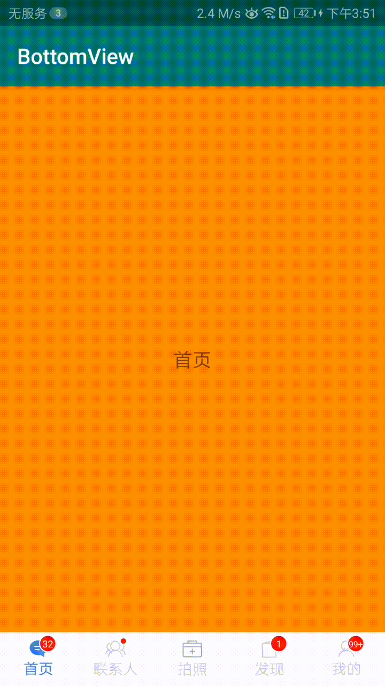
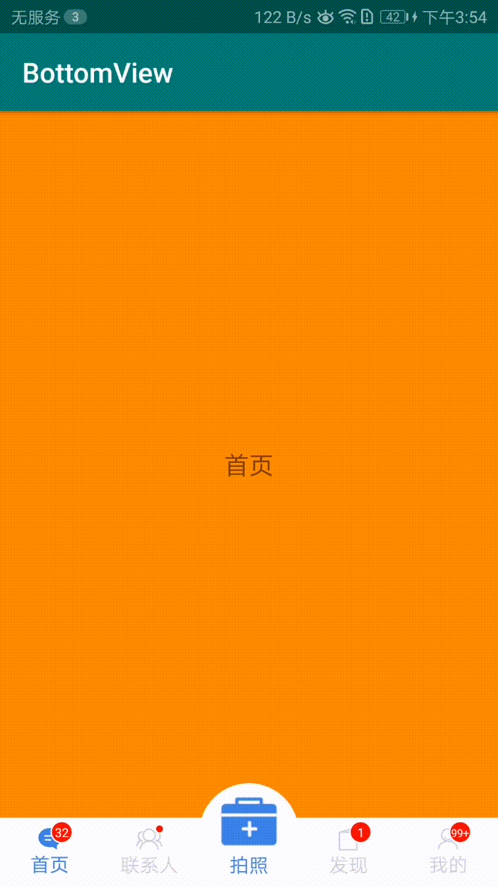

# [BottomNavigationBar](https://github.com/onestravel/BottomNavigationBar) 使用说明

## 简介：

##### BottomNavigationBar 是自定义的一个实现App应用底部导航栏功能的View,可以实现底部 2-5 个导航菜单（一般不会有更多），可以实现某一个菜单凸起的效果，如，有5个菜单，可以选择让第三个菜单凸起（floating），这是很多App都有的功能; 可以根据编写的颜色变化的资源文件来更改图标和文字选中时和未选中时的颜色，可以自由控制是否需要选中（checkable）,选择开启时，可变换为选中颜色，选择关闭时，不能更改为选择颜色;可以控制默认选中哪一项；可以设置某一个导航菜单的未读消息数（数字或者小红点）。

### 先看一组效果图

#### 五个菜单，没有凸起的，都是可选中的



<center>图1</center>

#### 中间有凸起，并且中间的不能选中，但点击事件可以响应



<center>图2</center>

## 引入方法

TAG:     [](https://jitpack.io/#onestravel/BottomNavigationBar)

#### gradle

- 在项目中的根目录下的 build.gradle (与model同级的) 中增加如下配置

```

	allprojects {
		repositories {
			...
			maven { url 'https://jitpack.io' }
		}
	}

```

- 在model 中的build.gradle 中增加依赖

```
dependencies {
implementation 'com.github.onestravel:BottomNavigationBar:TAG'
}

```

#### maven

- 在pom.xml文件中加入下面配置

```
	<repositories>
		<repository>
		    <id>jitpack.io</id>
		    <url>https://jitpack.io</url>
		</repository>
	</repositories>
```

- 添加maven依赖

```
	<dependency>
	    <groupId>com.github.onestravel</groupId>
	    <artifactId>BottomNavigationBar</artifactId>
	    <version>TAG</version>
	</dependency>

```


## 属性说明

### BottomNavigationBar 属性说明

| 属性               | 参考值                 | 说明                                                         |
| ------------------ | ---------------------- | ------------------------------------------------------------ |
| app:itemIconTint   | @drawable/tab_selecter | 整体的tab菜单的图片选中和未选中的颜色变化，传入一个资源drawable文件 |
| app:itemTextColor  | @drawable/tab_selecter | @drawable/tab_selecter@drawable/tab_selecter整体的tab菜单的图片选中和未选中的颜色变化，传入一个资源drawable文件 |
| app:floatingEnable | true/false             | 是否开启浮动，默认为false，设置为true是，可以实现中间凸起    |
| app:floatingUp     | 20dp                   | 设置Tab的上浮尺寸，比如：上浮20dp，上浮尺寸不可超过整个菜单高度的1/2 |
| app:menu           | @menu/botom_menu       | BottomNavigationBar导航栏的关键，设置导航栏的tab菜单                  |

#### 示例1:不需要浮动（凸起）的菜单，图1效果

```

    <cn.onestravel.navigation.view.BottomNavigationBar
        android:id="@+id/BottomLayout"
        android:layout_width="match_parent"
        android:layout_height="50dp"
        android:layout_alignParentBottom="true"
        android:background="@android:color/white"
        android:paddingTop="5dp"
        android:paddingBottom="5dp"
        app:menu="@menu/navigation_menu">

    </cn.onestravel.navigation.view.BottomNavigationBar>
    
```

#### 示例2:需要浮动（凸起）的菜单，图2效果

```
 <cn.onestravel.navigation.view.BottomNavigationBar
        android:id="@+id/BottomLayout"
        android:layout_width="match_parent"
        android:layout_height="50dp"
        android:layout_alignParentBottom="true"
        android:background="@android:color/white"
        android:paddingTop="5dp"
        android:paddingBottom="5dp"
        app:floatingEnable="true"
        app:floatingUp="25dp"
        app:menu="@menu/navigation_menu">

    </cn.onestravel.navigation.view.BottomNavigationBar>
```

### menu 菜单属性值说明

| 属性              | 参考值             | 说明                                                         |
| ----------------- | ------------------ | ------------------------------------------------------------ |
| android:id        | @+id/tab1          | 导航菜单 Item 的ID；                                         |
| android:icon      | @drawable/bar_news | 导航菜单 Item 的图标，可以是图标选择器（selector），也可以是默认图标，根据BottomNavigationBar的属性 app:itemIconTint 更改选中与不选中的颜色变化，默认为蓝色和灰色； |
| android:title     | 首页               | 导航菜单 Item 的文字，可以默认为空字符串，表示不设置；       |
| android:checkable | true/false         | 设置导航菜单 Item 是否可以选择，值影响选择与不选中效果，不影响点击事件； |
| android:checked   | true/false         | 设置导航菜单 Item 是否默认选中,默认为第一个选中，请不要在多个Item上设置改； |
| app:floating      | true/false         | 设置该导航菜单 Item 是否浮动，与BottomNavigationBar 的app:floatingEnable和 app:floatingUp属性配合使用，默认为false，即不浮动（不凸起）； |

#### 示例1:不需要浮动（凸起）的菜单，图1效果

```
<?xml version="1.0" encoding="utf-8"?>
<menu xmlns:android="http://schemas.android.com/apk/res/android"
    xmlns:app="http://schemas.android.com/apk/res-auto">

    <item
        android:id="@+id/tab1"
        android:icon="@drawable/bar_news"
        android:title="首页"></item>
    <item
        android:id="@+id/tab2"
        android:icon="@drawable/bar_constact"
        android:title="联系人"></item>
    <item
        android:id="@+id/tab5"
        android:icon="@drawable/tab_manage_selected"
        android:title="拍照"></item>
    <item
        android:id="@+id/tab3"
        android:icon="@drawable/bar_invite"
        android:title="发现"></item>
    <item
        android:id="@+id/tab4"
        android:icon="@drawable/bar_my"
        android:title="我的"></item>
</menu>
```

#### 示例2:需要浮动（凸起）的菜单，图2效果

```
<?xml version="1.0" encoding="utf-8"?>
<menu xmlns:android="http://schemas.android.com/apk/res/android"
    xmlns:app="http://schemas.android.com/apk/res-auto">

    <item
        android:id="@+id/tab1"
        android:icon="@drawable/bar_news"
        android:title="首页"></item>
    <item
        android:id="@+id/tab2"
        android:icon="@drawable/bar_constact"
        android:title="联系人"></item>
    <item
        android:id="@+id/tab5"
        android:icon="@drawable/tab_manage_selected"
        android:title="拍照"
        app:floating="true"
        android:checkable="false"></item>
    <item
        android:id="@+id/tab3"
        android:icon="@drawable/bar_invite"
        android:title="发现"></item>
    <item
        android:id="@+id/tab4"
        android:icon="@drawable/bar_my"
        android:title="我的"></item>
</menu>
```

